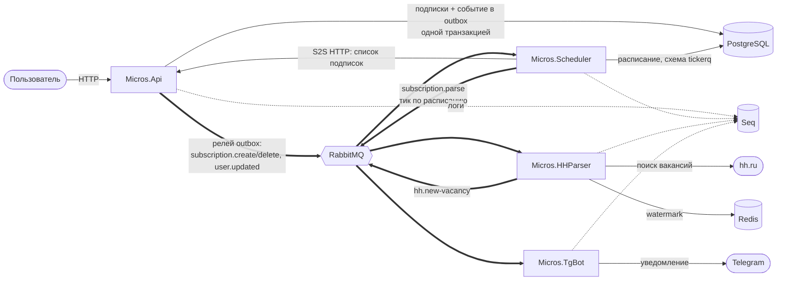

# Micros Backend
[](https://github.com/dima5513/micros/actions/workflows/ci.yml)

Бэкенд сервиса, который следит за поисками вакансий на hh.ru и шлёт пользователю уведомления в Telegram о новых вакансиях.

Как это работает: в Api заводится подписка → Scheduler по расписанию просит её спарсить → HHParser находит новые вакансии → TgBot присылает их в Telegram. Сервисы общаются через RabbitMQ.

## Потоки



Жирные стрелки — сообщения через RabbitMQ, пунктир — вспомогательные потоки.

## Сервисы

| Сервис | Что делает |
|---|---|
| **Micros.Api** | REST API. Управляет подписками и пользователями, об изменениях сообщает событиями в RabbitMQ. Есть внутренний S2S-эндпоинт. |
| **Micros.Scheduler** | Планировщик на TickerQ. Хранит расписание и по нему запускает парсинг каждой подписки. |
| **Micros.HHParser** | По команде планировщика парсит hh.ru и публикует новые вакансии в RabbitMQ. |
| **Micros.TgBot** | Telegram-бот. Доставляет уведомления подписчикам. |
| **Micros.Core** | Общие примитивы: опции, RabbitMQ, Redis, логирование, контракты сообщений. |

## Стек

.NET 10, PostgreSQL + EF Core, Redis, RabbitMQ, TickerQ, Serilog + Seq, Docker Compose.

## Что реализовано

### Работа с сообщениями

| Что | Как сделано |
|---|---|
| **Outbox** | Api не публикует в брокер напрямую. Событие пишется в таблицу `outbox_messages` в одной транзакции с бизнес-данными, фоновый релей отправляет его в RabbitMQ. |
| **Ретраи и DLQ** | Упавший обработчик возвращает сообщение в очередь и увеличивает счётчик `x-retry-count`. Когда попытки исчерпаны, сообщение уходит в очередь `micros.dead`. |
| **Идемпотентные консьюмеры** | `SubscriptionCreateConsumer` пропускает уже существующий тикер. `HHParser` отсекает повторы по watermark в Redis. |
| **Устойчивый HTTP** | Запросы к hh.ru обёрнуты в Polly-пайплайн с ретраями (`AddHhResilience`). |

### Наблюдаемость

| Что | Как сделано |
|---|---|
| **Сквозной correlation-id** | Один идентификатор проходит через все сервисы: `X-Correlation-Id` из HTTP-запроса → заголовок RabbitMQ → лог каждого сервиса. Подробности ниже. |
| **Структурные логи** | Serilog во всех четырёх сервисах. Просмотр и поиск — в Seq. |

### Api

| Что | Как сделано |
|---|---|
| **Аутентификация** | JWT в httpOnly-cookies. Пара access + refresh, обновление через `/api/auth/refresh`. |
| **S2S-авторизация** | Внутренние эндпоинты для Scheduler'а закрыты отдельной схемой `S2sAuthenticationHandler`, а не пользовательским JWT. |
| **Rate limiting** | Ограничение частоты запросов на уровне приложения. |
| **`Patch<T>`** | Отличает «поле не прислали» от «поле прислали как `null`». Реализовано своей `JsonConverterFactory`. |

### Инфраструктура

| Что | Как сделано |
|---|---|
| **CI** | GitHub Actions: сборка и прогон тестов на каждый push и pull request. |
| **Тесты** | Интеграционные на Testcontainers с настоящим PostgreSQL в Docker, unit-тесты парсера. |
| **Миграции** | EF Core, применяются при старте Api. |

## Сквозной correlation-id

Каждому запросу присваивается идентификатор. Он передаётся дальше на каждой границе между сервисами, поэтому все логи одного запроса можно найти по одному фильтру.

| Граница | Механизм |
|---|---|
| Входящий HTTP | `CorrelationIdMiddleware` берёт `X-Correlation-Id` из заголовка или создаёт новый, и возвращает его в ответе |
| Исходящий HTTP | `CorrelationIdHandler` подставляет заголовок в запросы Scheduler'а к Api |
| Публикация в RabbitMQ | `RabbitMqPublisher` вешает заголовок на сообщение |
| Приём из RabbitMQ | `RabbitMqBackgroundHostService` читает заголовок и открывает контекст на время обработки |
| Через Outbox | Id сохраняется в `outbox_messages.correlation_id` и восстанавливается релеем при публикации |

Внутри процесса id хранится в `AsyncLocal` (`CorrelationIdContext`) и попадает в Serilog `LogContext`. Поэтому каждая строка лога несёт `CorrelationId`, и передавать его в методы вручную не нужно. При ретраях и уходе в DLQ заголовок сохраняется.

Фильтр в Seq:

```
CorrelationId = '03e67d7573fa4e58b71d6fd1ff1ea749'
```

## Запуск

```bash
cp .env.template .env
docker compose --env-file=.env up -d
```

| Что | Адрес |
|---|---|
| API | `http://localhost:5090` |
| Swagger | `http://localhost:5090/api/docs` |
| Seq (логи) | `http://localhost:5341` |
| RabbitMQ UI | `http://localhost:15672` |

## Ограничения

- **Парсер завязан на вёрстку hh.ru.** `HHVacancyHttpApiClient` читает элемент `template#HH-Lux-InitialState`, а не публичный API.
- **Все подписки тикают одновременно.** Расписание одно на всех: `0 */2 * * * *` из `SchedulerOptions`.
- **Миграции применяются при старте Api через MigrateAsync().**
